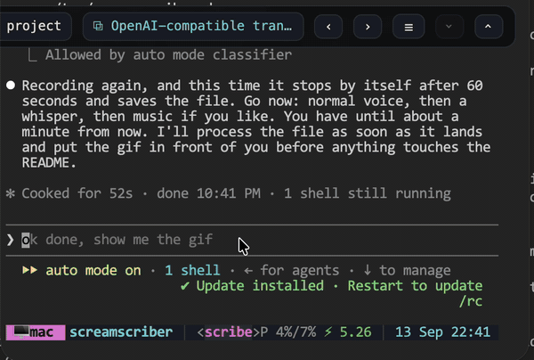
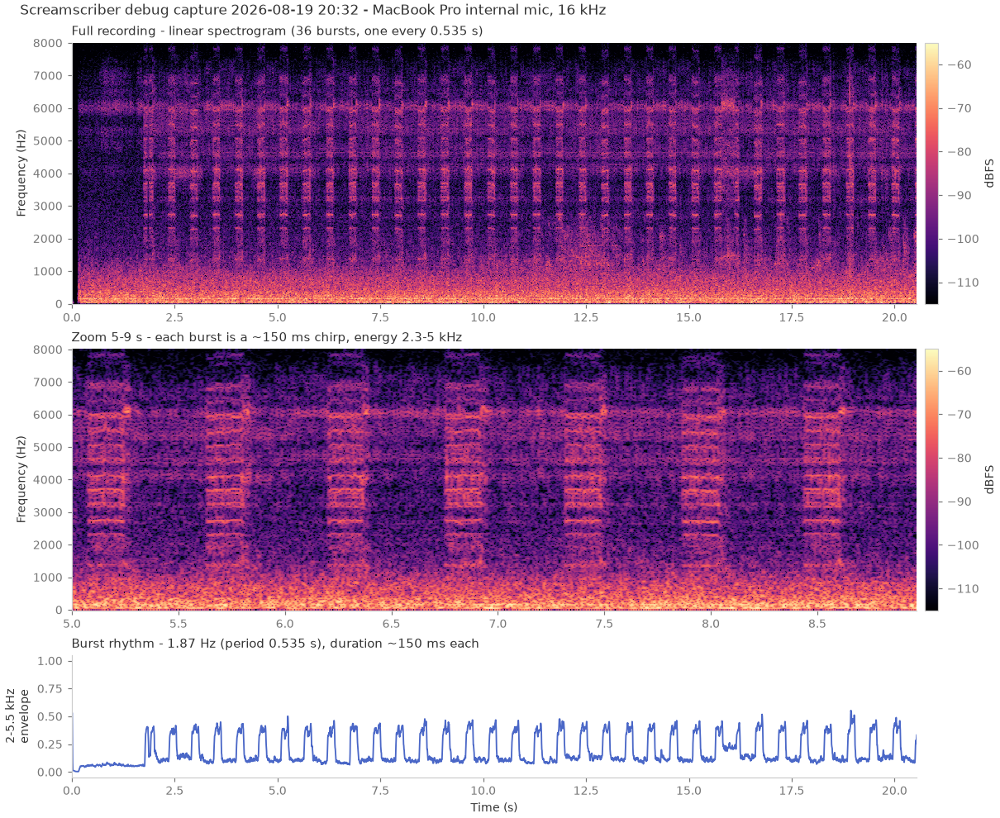

# Screamscriber

> Based on [WhisperWriter](https://github.com/savbell/whisper-writer) by [savbell](https://github.com/savbell)

    

Hold the key. Speak. Text appears. Wow.

    

## API Server

Screamscriber can host an OpenAI-compatible transcription API, so other apps or a second Screamscriber instance can send audio over the network for transcription.

See the [API Documentation](./assets/api_docs.html) for endpoints, examples, and chaining setup.

## The Beep

Once, this app hummed its own thoughts into its own microphone — and it took a human ear and a machine's spectrogram together to catch it.

After a macOS update, holding the dictation key produced a faint, distorted beep: too quiet to trust, too regular to ignore. Only one of us could hear it. But the app's own frequency analyzer showed the sound even in total silence — which meant the microphone was picking it up, and what a microphone captures, an assistant can analyze. Twenty seconds of recorded "silence" later, the confession was on paper: thirty-six bursts, one every 0.535 seconds, in a harmonic comb — the laptop's power circuitry singing under the pulsed GPU load of the live-transcription preview, picked up by the internal mic centimeters away.

The app was literally recording the sound of its own thinking. Read [the story of the beep](./docs/the-beep.md).

 

## Credits

- [savbell](https://github.com/savbell) for creating the original [WhisperWriter](https://github.com/savbell/whisper-writer) project.
- [OpenAI](https://openai.com/) for creating the Whisper model and providing the API.
- [Guillaume Klein](https://github.com/guillaumekln) for creating the [faster-whisper Python package](https://github.com/SYSTRAN/faster-whisper).

## License

This project is licensed under the GNU General Public License. See the [LICENSE](LICENSE) file for details.
